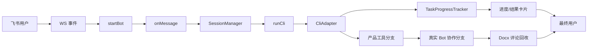

# Agent OS 源码导读（初学者版）：跟着一条飞书消息看懂整个项目

> 基线说明：本文按 2026-08-27 的工作区快照撰写，对应 Git commit `150e49e1e0a63aa98130221953f78439a3207284` 及当时未提交改动。这个快照不是干净、可编译的发布基线：`src/index.ts` 创建澄清 flow 时传入了 `collaboration`，而 `CreateClarificationFlowOptions` 没有该字段，`pnpm exec tsc --noEmit` 与 `pnpm build` 均失败。本文解释的是当前代码表达的设计和能够静态确认的控制流，不把该错误包装成已通过；完整命令与影响见独立验证报告。

> 阅读前只需要会 TypeScript 的接口、联合类型、`Map`、ESM import、`async/await`、事件回调和 JSON。第一次遇到 NDJSON、MCP、飞书话题与 `AbortSignal` 时，正文会就地解释。示例中的身份、会话、文档地址和工作目录均为占位内容。

## 开始之前：这篇文章应该怎样读

这不是“把所有文件从 A 念到 Z”的 API 手册，而是一张可以跟着走的源码地图。全文只追踪一件事：**用户在飞书里发出一条任务后，它怎样穿过 Agent OS，交给 Claude/Codex，最后又怎样回到飞书。**

先记住下面这条主链。后文每一节只负责解释其中一小段：

```text
飞书消息
  ↓
src/im/lark.ts：把飞书事件翻译成 IncomingMessage
  ↓
src/core/command-parser.ts：判断是命令还是普通任务
  ↓
src/core/session-manager.ts：找到或创建本地会话
  ↓
src/index.ts：组织本轮执行
  ↓
src/app/cli-execution.ts → src/cli/runner.ts：启动 CLI 子进程
  ↓
ClaudeAdapter / CodexAdapter：把不同协议翻译成 CliEvent
  ↓
TaskProgressTracker → CardUpdater：把事件变成进度卡片
  ↓
最终答案回到飞书，会话恢复 idle
```

为了让初学者不迷路，每个关键代码片段都按同一个顺序讲：

1. **先说人话**：这段代码在业务上解决什么问题。
2. **再看代码**：只保留理解控制流所需的片段。
3. **逐步拆解**：解释关键变量、判断和函数调用。
4. **输入与输出**：说明数据从哪里来、变成什么。
5. **下一站**：告诉你接下来应该打开哪个文件。

> 阅读建议：第一次只读第 0～6 节，先看懂普通消息主链。第 7～8 节是结构化澄清、产品方案、真实 Bot 协作和评论回改，属于主链上的高级分支。第 9～10 节用来独立开发和复习。

## 0. 先看终点：Agent OS 到底是什么

**本节目标：**先建立全局地图。读完后，你应该能用一句话说明 Agent OS 的职责，并知道 `im`、`core`、`app`、`cli`、`mcp` 五层各管什么。

### 0.1 先说人话：它是一家“翻译与调度中心”

Agent OS 是一个把“飞书话题”当作操作界面、把 Claude Code 或 Codex CLI 当作执行引擎的个人/小团队运行时。它不托管模型，不实现通用工作流画布，也不是多租户 SaaS。它解决的核心问题更窄：让一条即时消息获得稳定会话、受控工作目录、可停止的本地执行、低噪音进度、结构化产品决策，以及真实 Bot 之间可验证的交接。

全文只跟踪一条消息：用户在一个飞书话题中 @ CEO 助理：“请让产品经理整理一个 `/doctor` 诊断命令方案。”普通路径会把它交给一个 CLI，最终答案写进任务卡；产品路径会让 CLI 调用 `request_clarification` 或 `request_spec_approval`；团队路径则由 CEO 助理调用 `dispatch_task`，真正 @ 产品 Bot。若权威产物是待确认 Docx，后续 @ 评论还会恢复原产品 CLI 会话，修改同一地址，再把简短说明写回评论。



五个目录的边界由这条线自然显现：`im` 把飞书协议转换为应用能消费的对象并负责 REST 回写；`core` 保存会话、配置、状态机和稳定契约；`cli` 隔离供应商协议与子进程；`app` 编排用例；`mcp` 把只能由 Agent OS 解释的产品动作暴露给 CLI。`src/index.ts` 把它们装配起来。理解时要一直问七件事：谁调用、输入是什么、输出是什么、下一跳是谁、改了什么状态、失败在哪里、重试会不会重复副作用。

### 0.2 五层分别做什么

- `src/im`：只处理飞书协议。它像前台，负责收消息、发卡片、处理按钮和评论事件。
- `src/core`：保存稳定规则和状态。会话是什么、哪些状态可以互相切换，都在这里。
- `src/app`：组织一个完整用例。例如“继续澄清”“执行 CLI”“处理评论”，它会调用多个 core/cli/im 能力。
- `src/cli`：只处理本地命令行进程和 Claude/Codex 协议，不应该知道飞书卡片长什么样。
- `src/mcp`：给模型提供结构化工具，让“请用户选择”或“派发任务”不依赖自然语言猜测。
- `src/index.ts`：装配所有零件，并串起消息主链。它是总调度，不是每一条业务规则的归宿。

**本节检查：**如果删掉飞书，`cli` 层仍然应该能运行；如果换掉 Claude，`im` 层不需要重写。这就是分层的意义。

## 1. 启动：三个 Bot 如何变成一个运行时

**本节目标：**看懂“配置文件 → 可用 Bot → 共享运行时”的启动过程。此时还没有用户消息，系统只是在把零件装好。

### 1.1 第一步：读配置，但不把密钥写进配置

进程启动前先读 `config/bots.example.json` 所代表的配置形态。真实配置只保存环境变量的“名字”，不保存密钥的“值”；`teamLeader` 决定谁能调用派发工具，`defaultProductDeliveryMode` 决定产品经理默认提交本地文件还是一个 Docx，`bots` 中每项则给出独立飞书身份、默认 CLI、工作目录、角色和 Skills。下面只保留结构并脱敏，字段语义与当前文件一致。

下面先看 `config/bots.example.json` 的最小结构：

```json
{
  "teamLeader": "ceo-assistant",
  "defaultProductDeliveryMode": "lark-doc",
  "bots": [
    {
      "id": "ceo-assistant",
      "appIdEnv": "FEISHU_CEO_APP_ID",
      "appSecretEnv": "FEISHU_CEO_APP_SECRET",
      "defaultCli": "claude",
      "workspace": "../team-workspace",
      "role": "负责理解目标、组织成员并汇总",
      "skills": []
    }
  ]
}
```

### 1.2 第二步：把“不可信 JSON”变成“可信配置对象”

先说人话：配置文件只是普通 JSON，字段可能缺失、拼错或互相矛盾，不能直接拿去启动 Bot。`loadAgentOsConfig` 先读 JSON，再让 `parseAgentOsConfig` 通过 Zod 校验；解析器从 `env` 取出 app id 与 secret，把相对工作目录解析为绝对目录，并验证 id 去重、leader 已启用、`reviewBy` 不指向自己或禁用成员。任何缺失都在启动期失败，而不是等第一条消息才暴露。

`src/core/bot-registry.ts` · `parseAgentOsConfig`：

```ts
export function parseAgentOsConfig(
  input: unknown,
  env: Environment,
  baseDirectory = process.cwd(),
): AgentOsConfig {
  const parsed = BotConfigFileSchema.parse(input);
  const ids = new Set<string>();
  for (const bot of parsed.bots) {
    if (ids.has(bot.id)) throw new Error(`bot id 不能重复: ${bot.id}`);
    ids.add(bot.id);
  }
  const configs = parsed.bots
    .filter((bot) => bot.enabled)
    .map((bot) => {
      const appId = env[bot.appIdEnv]?.trim() ?? "";
      const appSecret = env[bot.appSecretEnv]?.trim() ?? "";
      if (!appId) throw new Error(`bot ${bot.id} 缺少环境变量 ${bot.appIdEnv}`);
      if (!appSecret)
        throw new Error(`bot ${bot.id} 缺少环境变量 ${bot.appSecretEnv}`);
      return {
        id: bot.id,
        appId,
        appSecret,
        defaultCliId: bot.defaultCli,
        role: bot.role,
        skills: [...new Set(bot.skills)],
        workspaceDir: resolveWorkspacePath(
          bot.workspace ?? env.CLI_WORKDIR ?? env.CLAUDE_WORKDIR ?? ".",
          baseDirectory,
        ),
      };
    });
  // 省略：leader、reviewBy 与启用成员的交叉校验。
  return {
    teamLeaderId: parsed.teamLeader,
    defaultProductDeliveryMode: parsed.defaultProductDeliveryMode,
    bots: configs,
  };
}
```

调用者是顶层 `index.ts`，核心输入是未经信任的 JSON、环境映射和基准目录，输出是带真实凭据与已解析目录的 `AgentOsConfig`。状态副作用只有读文件；它不会连接网络。密钥从这里进入内存后只交给 `startBot`，因此文章、日志与错误信息都不应打印 `appSecret`。`loadAgentOsConfig` 还会把 `ENOENT` 和 JSON/Zod 错误改写成可诊断的配置错误。下一跳是团队注册表与运行时装配。

逐步拆解：

1. `BotConfigFileSchema.parse(input)`：先验证整个 JSON 的形状，失败就立即抛错。
2. `Set<string>`：记录已经见过的 Bot id，防止两个配置使用同一个身份键。
3. `env[bot.appIdEnv]`：配置里保存的是环境变量名称，真正密钥只在运行时读取。
4. `.filter((bot) => bot.enabled)`：禁用成员不会进入运行时。
5. `resolveWorkspacePath(...)`：把相对目录变成明确的绝对工作目录。
6. 最后的 `return`：输出已经校验过的 `AgentOsConfig`，后续代码可以依赖它的字段存在。

**输入：**未知结构的 JSON、环境变量、配置文件所在目录。

**输出：**可启动的 Bot 列表、团队 Leader、默认交付方式。

**下一站：**`src/index.ts` 用这个输出创建注册表、会话仓库和 Bot 连接。

`TeamRegistry` 用配置构建长期成员表。`contextFor` 把成员、角色、Skills、Leader 和“内部子 Agent 不等于长期 Bot”的规则注入每次 prompt；`findMissingSkills` 按工作区 `.agents`、工作区 `.claude`、用户级目录依次探测，确保项目版本优先。它只确认 `SKILL.md` 是否存在，不替 CLI 读取内容。`buildBotPrompt` 再把角色、团队上下文、产品交付规则、Skill 加载规则和 1200 中文字符的飞书输出约束包在原任务外。输入仍是我们的 `/doctor` 请求，输出已是带组织边界的完整 CLI prompt。

### 1.3 第三步：在 `src/index.ts` 装配运行时

装配发生在模块顶层。这里的 `Map` 有两种寿命：`sessions` 与 `productSpecFlows` 背后有 JSON store，跨重启恢复；`activeRuns`、上下文窗口、协作去重和评论队列只在当前进程有效。`AppRuntime` 是依赖容器，聚合这些对象，避免每个应用服务都依赖大量全局变量；它本身不执行任务。

`src/index.ts` · composition root：

```ts
const agentOsConfig = await loadAgentOsConfig(botConfigPath);
const botConfigs = agentOsConfig.bots;
const teamRegistry = new TeamRegistry(agentOsConfig.teamLeaderId, botConfigs);
await Promise.all(
  botConfigs.map((config) => ensureWorkspaceDirectory(config.workspaceDir)),
);
const sessions = await SessionManager.open({
  store: new JsonSessionStore(join("data", "sessions.json")),
});
const activeRuns = new Map<string, ActiveRun>();
const contextWindows = new Map<string, number>();
const botRuntimes = new Map<string, BotRuntime>();
const collaborationInbox = new CollaborationInbox();
const clarificationFlows = new ClarificationFlowStore();
// 省略：其余 flow store 与 runtime 字段。
async function startConfiguredBot(
  config: BotConfig,
  collaborationService: CollaborationService,
): Promise<void> {
  const startedBot = startBot({
    appId: config.appId,
    appSecret: config.appSecret,
    onCardAction: createCardActionHandler({
      runtime,
      config,
      collaborationService,
      defaultProductDeliveryMode: agentOsConfig.defaultProductDeliveryMode,
    }),
    onDocumentComment: config.skills.includes("lark-drive")
      ? async (comment, bot) => scheduleDocumentComment(config, bot, comment)
      : undefined,
    onMessage: async (msg, bot) => {
      /* 省略：消息主链路。 */
    },
  });
  const identity = await startedBot.getIdentity();
  botRuntimes.set(config.id, { config, bot: startedBot, identity });
  if (config.skills.includes("lark-drive"))
    await startedBot.subscribeToDocumentComments();
}
```

输入是解析后的 Bot 配置和本地 `data` 目录，输出是整个进程共享的 `runtime`。启动在工作目录不存在、session 文件不是数组或 store 解析失败时中止。值得注意的是，各 Bot 共享同一个 Node 进程和这些注册表，却有不同 app id/secret、身份、默认 CLI 与 workspace；“共享运行时”不代表“共享飞书身份”或“共享 Agent OS 会话”。

随后 `startConfiguredBot` 给每个配置注册三类入口：消息、卡片回调、文档评论。只有声明 `lark-drive` Skill 的 Bot 才订阅评论；拿到 `getIdentity()` 结果后才写入 `botRuntimes`。若订阅失败，启动 Promise 失败，不会宣称该 Bot 已完整就绪。

到这里还没有处理我们的业务文本。`startConfiguredBot` 的直接调用者是底部 `Promise.all(botConfigs.map(...))`，输出是“完成连接与身份登记”的 Promise，副作用是启动 WebSocket、创建 SDK client、订阅评论并填充内存注册表。下一跳在 `startBot` 注册的 `im.message.receive_v1` 回调里。

**本节检查：**启动阶段的终点不是“得到模型答案”，而是“所有 Bot 已连接、身份已登记、事件入口已注册”。下一节才真正收到用户消息。

## 2. 入口：飞书事件如何变成 IncomingMessage

**本节目标：**看懂一条飞书 SDK 原始事件，怎样被压平成项目内部统一消息。只要这一层稳定，后面就不需要到处判断飞书嵌套字段。

### 2.1 先分清“接收”和“回复”

飞书接入同时使用两条通道。WebSocket 长连接接收消息、卡片动作和 Drive 评论事件；SDK client 的 REST 方法负责回复文本、回复或 patch 卡片、@ 成员、下载资源和回写评论。把接收与回写分开理解很重要：`startBot` 返回的 `Bot` 不是 WebSocket 对象，而是应用层可调用的能力集合。

### 2.2 把飞书对象翻译成 `IncomingMessage`

先说人话：`IncomingMessage` 是消息入口的“统一快递箱”。飞书 SDK 的嵌套字段被压平成稳定字段，后续代码不再知道 `data.sender.sender_id.open_id` 的层级。四个容易混淆的标识各司其职：`messageId` 定位当前消息并作为回复锚点；`chatId` 区分群或私聊容器；`rootId` 指向回复树根；`threadId` 指向话题。Agent OS 会优先使用 thread，其次 root，最后当前 message 建立话题身份。

`src/im/lark.ts` · `IncomingMessage` 与事件转换：

```ts
export interface IncomingMessage {
  messageId: string;
  chatId: string;
  messageType: string;
  text: string;
  rootId: string;
  threadId: string;
  senderOpenId: string;
  mentions: Mention[];
  rawContent: string;
}

"im.message.receive_v1": async (data) => {
  const message = data.message;
  const msg: IncomingMessage = {
    messageId: message.message_id,
    chatId: message.chat_id,
    messageType: message.message_type,
    text: extractMessageText(message.message_type, message.content),
    rootId: message.root_id ?? "",
    threadId: message.thread_id ?? "",
    senderOpenId: data.sender.sender_id?.open_id ?? "",
    mentions: parseMentions(message.mentions),
    rawContent: message.content,
  };

  await onMessage(msg, bot);
},
```

输入是 SDK 原始事件，输出是 `IncomingMessage`，直接被 `startConfiguredBot.onMessage` 消费。`extractMessageText` 对 `text` 读取 `parsed.text`；对 `post` 遍历二维 `content` 数组，把段内 `text/a/code/code_block/md` 拼接、`br` 变成换行、`at` 暂留其 `user_id`/占位文本。未知消息类型返回空字符串，而不是猜测内容。JSON 格式不合法会抛出，当前 dispatcher 没有在这一层单独降级，这是一个协议输入边界。

逐步拆解：

1. 事件名 `im.message.receive_v1` 表示这是飞书消息回调。
2. `const message = data.message` 只是缩短后续访问路径。
3. `extractMessageText(...)` 把 text/post 等不同正文格式统一成字符串。
4. `?? ""` 表示字段缺失时使用空字符串，避免把 `undefined` 扩散到后续业务。
5. `parseMentions(...)` 单独保存 @ 信息，因为正文里的 @ 可能只是占位符。
6. `await onMessage(msg, bot)` 是翻译层与业务层的交界：从这里开始，后续只处理项目自己的类型。

**输入：**飞书 SDK 的嵌套事件对象。

**输出：**扁平、稳定的 `IncomingMessage`。

**下一站：**`src/im/message-parser.ts` 还原 @ 人名，再交给命令解析器。

### 2.3 为什么还要单独处理 @ 和附件

飞书 `post` 是“段落数组的数组”，不能按平面节点读。@ 在事件正文中也可能是 `@_user_1` 一类占位符；mentions 数组才携带显示名与 open id。`parseMentions` 先建立映射，`resolveMentions` 再替换所有占位符，因此命令正则最终看到的是“@CEO助理 /doctor …”而不是 SDK 内部 key。

`src/im/message-parser.ts` · mentions 与资源：

```ts
export function parseMentions(raw: any[] | undefined): Mention[] {
  if (!raw?.length) return [];
  return raw.map((m) => ({
    key: m.key,
    name: m.name ?? "",
    openId: m.id?.open_id ?? "",
  }));
}
export function resolveMentions(text: string, mentions: Mention[]): string {
  let resolved = text;
  for (const m of mentions) resolved = resolved.replaceAll(m.key, `@${m.name}`);
  return resolved.trim();
}
export function extractResourceKeys(messageType: string, content: string) {
  const parsed = JSON.parse(content);
  const resources = [];
  if (messageType === "image" && parsed.image_key)
    resources.push({ type: "image" as const, key: parsed.image_key });
  if (messageType === "file" && parsed.file_key)
    resources.push({
      type: "file" as const,
      key: parsed.file_key,
      fileName: parsed.file_name,
    });
  // 省略：post 二维节点中的 img/image_key 收集。
  return resources;
}
```

解析 mentions 没有网络副作用；资源分支则只提取 key，真正下载在 session 已切到 `active` 后由 `bot.downloadResource` 完成，并写入 `data/downloads`。下载失败只记错误，任务继续，因此附件是辅助输入，不是主执行的事务前置条件。文件名扩展名会从原名或 Content-Type 推断，但落盘名仍由资源 key 派生；日志或文章不应曝光真实 key。

Bot API 还有几个边界：`reply` 和 `replyMention` 会按飞书字符上限裁剪；`replyCard` 发新卡，`updateCard` patch 已有卡；评论回复上限更小。`startBot` 通过 `Lark.EventDispatcher` 注册 handler，再让 `WSClient.start` 持续收事件。它返回 `Bot` 让应用立即拥有 REST 能力，而长连接在 SDK 内部继续运行。

应用或 Bot 发来的消息不会仅凭 `senderType` 被信任。`onMessage` 要求它是 post、确实 @ 当前 Bot、正文带 12 位 dispatch id，且该 id 能从 `CollaborationInbox` 一次性消费；随后还验证来源 runtime 与 turn key。普通 Bot 自说“这是协作任务”不够。这条安全边界留到第 8 节完整闭环。对我们的用户消息，下一跳是命令解析、话题 task id 和会话解析。

**本节检查：**如果你能回答“为什么不能直接把 `data.message` 传遍整个项目”，就已经抓住本节重点：外部协议会变，内部业务需要稳定契约。

## 3. 定位：命令、话题与 Agent OS 会话

**本节目标：**理解系统为什么不能收到文本就立刻启动 CLI。它必须先回答三个问题：这是控制命令吗？属于哪个飞书话题？应该复用哪个本地/CLI 会话？

### 3.1 第一个岔路口：命令还是普通任务

Agent OS 在执行前先区分“控制消息”和“任务消息”。`parseCommand` 只接受整条文本符合正则的斜杠命令；`parseCliRequest` 只把 `/claude <任务>`、`/codex <任务>` 识别为显式引擎选择。可选的 `@… ` 前缀让群里 @ Bot 后仍能用命令，但正文中间出现 `/close` 不会误关会话。我们的示例没有现成 `/doctor` 命令，因此此时它仍是产品设计任务，而不是运行诊断。

`src/core/command-parser.ts` · `parseCommand/parseCliRequest`：

```ts
export type SlashCommand =
  | { name: "close" | "status" | "help" | "new" | "resume" | "team" }
  | { name: "compact"; instructions?: string }
  | { name: "cd"; path?: string };
const COMMAND_RE = /^(?:@.+?\s+)?\/(close|status|help|new|resume|team)\s*$/;
const CD_RE = /^(?:@.+?\s+)?\/cd(?:\s+([\s\S]+?))?\s*$/;
const COMPACT_RE = /^(?:@.+?\s+)?\/compact(?:\s+([\s\S]+?))?\s*$/;
const CLI_REQUEST_RE = /^(?:@.+?\s+)?\/(claude|codex)(?:\s+([\s\S]*))?$/;
export function parseCommand(text: string): SlashCommand | undefined {
  const value = text.trim();
  const cdMatch = CD_RE.exec(value);
  if (cdMatch) return { name: "cd", path: cdMatch[1]?.trim() || undefined };
  const compactMatch = COMPACT_RE.exec(value);
  if (compactMatch)
    return {
      name: "compact",
      instructions: compactMatch[1]?.trim() || undefined,
    };
  const match = COMMAND_RE.exec(value);
  return match ? { name: match[1] as SlashCommand["name"] } : undefined;
}
```

解析器输入是 mentions 已还原的字符串，输出是窄联合或 `undefined`，没有状态副作用。显式 `/claude` 没有 prompt 时，`index.ts` 会先回复示例并结束；已有话题若再请求另一 CLI，`handleSessionCommand` 会拒绝，避免把一个 Agent OS 会话同时绑到两套外部上下文。下一跳是 `topicTaskId` 与 `SessionManager.resolve`。

逐步拆解：

1. `text.trim()` 去掉用户输入两侧空白，减少无意义差异。
2. 先匹配带参数的 `/cd` 和 `/compact`，因为它们需要保留后面的内容。
3. 再匹配无参数命令，返回 TypeScript 判别联合。
4. 所有正则都有 `^` 和 `$`，要求整条消息匹配；正文里偶然出现 `/close` 不会关闭会话。
5. 没有命中就返回 `undefined`，告诉上层“这是一条普通任务”。

**输入：**还原 @ 后的纯文本。

**输出：**一个窄类型命令，或者 `undefined`。

**下一站：**为普通任务寻找 Agent OS session。

### 3.2 四种 id 不要混在一起

这里必须分开四类标识：

- `messageId`：飞书某一条具体消息，常用作回复锚点。
- `chatId + thread/root/message`：飞书话题身份，说明对话发生在哪里。
- `session.id`：Agent OS 自己生成的本地会话 id，用于状态、停止按钮和持久化。
- `cliSessionId`：Claude session 或 Codex thread，只用于继续供应商上下文。

`topicTaskId` 则把飞书话题做 SHA-256 并截成 24 位，供澄清、审批、协作跨消息关联。前几类 id 属于不同系统，绝不能因为“看起来都像字符串”就互换。

### 3.3 `SessionManager.resolve`：复用旧会话，或创建新会话

`SessionManager.resolve` 的 key 还包含 `botId`，所以同一飞书话题被不同长期 Bot 接手时不会误共用本地会话。已有 key 原样复用；新 key 创建 `creating` session 并立即持久化。若持久化失败，内存插入回滚，调用者不会拿到一个只有内存、没有磁盘记录的半成品。

`src/core/session-manager.ts` · `resolve/transition`：

```ts
const ALLOWED_TRANSITIONS: Record<SessionStatus, SessionStatus[]> = {
  creating: ["active", "idle", "closed"],
  active: ["idle", "closed"],
  idle: ["active", "closed"],
  closed: [],
};

async resolve(
  message: MessageAddress,
  cliId: CliId,
  botId: string,
  workspaceDir: string,
): Promise<ResolvedSession> {
  const threadId = topicIdOf(message);
  const key = `${botId}:${message.chatId}:${threadId}`;
  const existing = this.sessions.get(key);
  if (existing) return { session: existing, isNew: false };

  const now = this.now().toISOString();
  const session = {
    id: this.createId(),
    botId,
    threadId,
    chatId: message.chatId,
    cliId,
    workspaceDir,
    status: "creating" as const,
    createdAt: now,
    updatedAt: now,
  };

  this.sessions.set(key, session);
  try {
    await this.persist();
  } catch (error) {
    if (this.sessions.get(key) === session) this.sessions.delete(key);
    throw error;
  }
  return { session, isNew: true };
}
```

状态机表达的是“本地是否允许发起执行”，不是模型回答质量：`creating` 是新会话尚未真正运行，`active` 表示有活动进程，`idle` 可接下一条任务，`closed` 终结且无出边。`transition` 会先验证 `ALLOWED_TRANSITIONS`，以新对象替换 Map，再持久化；落盘失败则恢复旧对象。并发消息看到 `active` 会被明确拒绝，当前实现没有在同一 session 内排队普通任务。

逐步拆解：

1. `topicIdOf(message)` 按 thread → root → message 的顺序找到稳定话题锚点。
2. key 加上 `botId`，所以同一话题被不同长期 Bot 处理时不会共享会话。
3. Map 已有 key 就直接复用，并返回 `isNew: false`。
4. 没有才创建 `creating` 状态；此时 CLI 还没启动。
5. 先写内存，再持久化；如果持久化失败，就删掉刚写入的内存对象并继续抛错。

**输入：**消息地址、所选 CLI、Bot id、工作目录。

**输出：**已有或新建的 Session。

**关键副作用：**新会话会写入 JSON store。

**下一站：**控制命令可能就地处理；普通任务进入 `src/index.ts` 编排。

`setCliSessionId` 在首轮 CLI 返回 session/thread 后绑定外部上下文，空 id 被拒绝；`clearCliSessionId` 支持 `/new`；`setWorkspaceDir` 如果目录变化，会通过对象解构删除旧 `cliSessionId`。这是必要边界：供应商会话通常与工作目录和仓库上下文耦合，不能在 `/cd` 后悄悄 resume 旧上下文。目录本身先经 `resolveWorkspacePath` 和 `ensureWorkspaceDirectory` 解析、验证，但当前代码允许切到任何调用者有权限访问的绝对路径，并没有额外的 workspace 根目录沙箱，部署者必须用操作系统权限控制边界。

### 3.4 为什么 Session 需要落盘

重启恢复由 store 负责。JSON 每行不是 session；整个文件是数组。每条先迁移缺 `botId/workspaceDir` 的旧记录，再以 Zod 验证。不合法条目被丢弃；`creating` 或 `active` 被保守改成 `idle`，因为原 Node 进程和子进程已经消失。这只代表“允许重新处理”，不代表中断任务成功。

`src/core/session-store.ts` · `load/save`：

```ts
function recoverInterruptedSession(session: Session): Session {
  if (session.status !== "creating" && session.status !== "active") {
    return session;
  }
  return { ...session, status: "idle" };
}

async load(): Promise<Session[]> {
  // 省略：ENOENT 返回空数组，JSON 顶层必须是数组。
  const sessions: Session[] = [];
  for (const row of rows) {
    const { candidate, migrated } = migrateLegacySession(
      row,
      this.legacyBotId,
      this.defaultWorkspaces,
    );
    const result = SessionSchema.safeParse(candidate);
    if (!result.success) continue;
    sessions.push(recoverInterruptedSession(result.data));
  }
  if (needsCleanup) await this.save(sessions);
  return sessions;
}

save(sessions: Session[]): Promise<void> {
  const snapshot = JSON.stringify(sessions, null, 2);
  const write = async () => {
    await writeFile(`${this.filePath}.tmp`, `${snapshot}\n`);
    await rename(`${this.filePath}.tmp`, this.filePath);
  };
  this.writeQueue = this.writeQueue.then(write, write);
  return this.writeQueue;
}
```

`writeQueue` 把并发保存串起来；临时文件 rename 降低写一半导致文件损坏的风险。它不是跨进程锁，因此同一数据文件只能由一个 Agent OS 进程负责。`SessionManager.open` 的输入是 store，输出是已加载 Map 的 manager；store 清理旧数据时也会产生写副作用。

### 3.5 控制命令为什么不进入模型

控制命令在 `handleSessionCommand` 中消费同一个 session。选三个代表分支就能看清约束：`/new` 要求非 active/closed，清空 CLI id 但保留 Agent OS session；`/cd` 要求非 active，验证目录后切换并清空旧 CLI id；`/close` 若有 active run 就先把 `cancelMode` 标成 `close` 并 abort，再把 session 置 `closed`。其他 `/status`、`/help`、`/team`、`/resume`、`/compact` 在末尾索引可定位。

`src/app/command-handler.ts` · 三个代表分支：

```ts
if (command?.name === "new") {
  if (session.status === "active" || session.status === "closed")
    return "handled";
  await runtime.sessions.clearCliSessionId(session.id);
  await bot.replyCard(
    msg.messageId,
    buildSessionNoticeCard({
      title: "新会话已就绪",
      template: "green",
      detail: "下一条任务会开启全新的 CLI 会话。",
    }),
    hasThread,
  );
  return "handled";
}
if (command?.name === "cd" && command.path) {
  if (session.status === "active") return "handled";
  const workspaceDir = resolveWorkspacePath(command.path, session.workspaceDir);
  await ensureWorkspaceDirectory(workspaceDir);
  await runtime.sessions.setWorkspaceDir(session.id, workspaceDir);
  return "handled";
}
if (command?.name === "close") {
  const active = runtime.activeRuns.get(session.id);
  if (active) {
    active.cancelMode = "close";
    active.controller.abort();
  }
  if (session.status !== "closed")
    await runtime.sessions.transition(session.id, "closed");
  return "handled";
}
```

这个片段为讲解压缩了回复文案，但调用顺序与分支语义保持不变。应用层输入包含 runtime、Bot、消息、session、adapter 和解析结果，输出只有 `'handled' | 'continue'`：前者要求 `index.ts` 立即返回，后者继续普通执行或 `/compact`。失败边界落在每个命令旁，而不是统一吞掉：例如 `/cd` 会把路径错误回复给用户，`/resume` 会捕获原生会话读取错误。我们的 `/doctor` 设计任务返回 `continue`，下一跳终于是 `src/index.ts` 的一次任务编排。

**本节检查：**看到一个 id 时，先问“它属于飞书、Agent OS，还是 CLI 供应商？”看到一个状态时，先问“它允许下一步做什么？”这两个习惯能避免大量会话类 bug。

## 4. 编排：index.ts 如何启动一次任务

**本节目标：**把前面准备好的消息、会话和 Bot 配置串起来，真正启动一轮后台任务。这是全文最重要的“总控制器”。

### 4.1 先说人话：`index.ts` 像总导演

`src/index.ts` 是 composition root，也是当前应用编排器：它知道一条消息要依次经过 mentions、命令、session、prompt、卡片、CLI 和产品 flow，但不拥有供应商协议解析、状态机规则或卡片 JSON 的细节。文件很长并不意味着所有逻辑都应继续堆在这里；它更像把应用服务连接起来的总线。

### 4.2 从消息得到最终 prompt

消息回调先计算 `resolved` 与稳定 `taskId`，再处理受信协作、命令和显式 CLI 请求。`sessions.resolve` 使用协作消息携带的 workspace 或 Bot 默认 workspace；随后 `getCliAdapter(session.cliId)` 只从注册表取已构造的 Claude/Codex adapter。普通文本、澄清补充文本与协作 prompt 三选一，最后由 `buildBotPrompt` 注入当前 Bot 的角色、团队和产品政策。这个顺序保证“同一条用户文字”在不同长期 Bot 手里获得不同职责，而会话选择仍先于执行。

`src/index.ts` · 从消息到 prompt：

```ts
const resolved = resolveMentions(msg.text, msg.mentions);
const taskId = topicTaskId(msg);
const command = parseCommand(resolved);
const cliRequest = parseCliRequest(resolved);
const resolvedSession = await sessions.resolve(
  msg,
  cliRequest?.cliId ?? config.defaultCliId,
  config.id,
  collaboration?.workspaceDir ?? config.workspaceDir,
);
let { session } = resolvedSession;
const cliAdapter = getCliAdapter(session.cliId);
const taskText = pendingClarification
  ? formatClarificationMessage(
      pendingClarification,
      cliRequest?.prompt ?? resolved,
    )
  : collaboration
    ? buildCollaborationPrompt(collaboration)
    : (cliRequest?.prompt ?? resolved);
const prompt = buildBotPrompt(
  config,
  taskText,
  teamRegistry.contextFor(config.id),
  agentOsConfig.defaultProductDeliveryMode,
);
```

当前快照中 `formatClarificationMessage` 的调用与二参数签名一致；真正阻塞编译的是后续创建 clarification flow 时多出的 `collaboration` 字段。这个差异也说明片段必须按冻结快照复查，不能只沿用早期调研结论。

逐步拆解：

1. `resolveMentions` 先把飞书 @ 占位符还原成人能读的文本。
2. `topicTaskId` 为当前话题生成稳定任务键，供后续澄清/审批关联。
3. `parseCommand` 与 `parseCliRequest` 分别识别控制命令和显式引擎选择。
4. `sessions.resolve` 决定这条消息属于哪个本地会话。
5. `getCliAdapter` 根据 session 的 `cliId` 选择 Claude 或 Codex。
6. `taskText` 三选一：普通用户文本、澄清补充、团队协作 prompt。
7. `buildBotPrompt` 最后才注入角色和组织边界，形成真正交给 CLI 的 prompt。

**输入：**`IncomingMessage`、Bot 配置、团队注册表。

**输出：**Session、CLI adapter、最终 prompt。

**下一站：**把 session 切到 active，先创建飞书进度卡，再启动子进程。

### 4.3 为什么先把 Session 切成 active

命令若未处理，编排器会拒绝 closed、仍 creating 或 active 的 session；用户用新消息替代旧澄清卡时，旧 flow 被删除，旧卡 patch 成失效，patch 失败只告警而不阻断新任务。协作携带不同 workspace 时先验证并调用 `setWorkspaceDir`。这些检查结束后，session 才从 creating/idle 转为 active。

`AbortController` 是浏览器与 Node 通用的取消信号容器。这里把 controller 与 owner 写进 `activeRuns`，停止按钮只能对同一个 session、同一个发起人调用 `abort()`。附件下载发生在 active 后，但失败不终止执行。然后系统先发 running 卡；没有 `message_id` 就不能安全 patch 进度，因此清掉 active run、把 session 恢复 idle 并停止，而不是盲跑 CLI。

先发卡是因为事件回调应尽快完成，用户也需要立即看到任务已受理；卡片 id 又是进度与终态的更新锚点。拿到 id 后创建 tracker、节流 updater 与 heartbeat，`void execution` 让 WebSocket handler 不必等待 CLI Promise。

`src/index.ts` · active run、初始卡与后台执行：

```ts
await sessions.transition(session.id, "active");
const run = new AbortController();
const activeRun: ActiveRun = {
  controller: run,
  ownerOpenId: collaboration?.ownerOpenId ?? msg.senderOpenId,
};
activeRuns.set(session.id, activeRun);

const cardId = await bot.replyCard(
  msg.messageId,
  buildTaskCard({
    title: taskCardTitle,
    status: "running",
    detail: "正在理解任务",
    abortSessionId: session.id,
  }),
  hasThread,
);
if (!cardId) {
  activeRuns.delete(session.id);
  await markSessionIdle(sessions, session.id);
  return;
}
const progress = new TaskProgressTracker(
  Date.now,
  contextWindows.get(session.id),
  !session.cliSessionId,
);
const cardUpdater = new ThrottledCardUpdater((card) =>
  bot.updateCard(cardId, card),
);
const execution = executeCli(
  cliAdapter,
  prompt,
  session.workspaceDir,
  session.cliSessionId,
  run.signal,
  (event) => {
    progress.accept(event);
    renderProgress();
  },
);
void (
  execution
    .then(/* 成功与产品分支 */)
    .catch(/* 取消或失败 */)
    .finally(/* 共享清理 */)
);
```

真实代码只把 `tool_start/tool_end/context` 交给 tracker。成功先保存 CLI session 与上下文窗口，再识别澄清、产品方案和 dispatch；普通结果才写 success 卡。`.catch` 以 signal 区分 cancelled 与 failed，`.finally` 只清 heartbeat、按 controller 身份删除 active run，并用 `markSessionIdle` 收回仍 active 的会话；closed 不会被复活。最终卡由各业务分支调用 `finish`，不能让统一 finally 覆盖真实终态。

这段代码可以按时间顺序读：

1. `transition(..., "active")` 抢占当前会话，阻止第二条消息并发启动。
2. `AbortController` 是本轮任务的停止开关；`activeRuns` 额外记录谁有权停止。
3. `replyCard` 先发“执行中”卡片，拿到 `cardId` 作为以后 patch 的地址。
4. 如果连卡片 id 都没有，就立即撤销 active 状态，不在用户无感知时偷偷运行 CLI。
5. `TaskProgressTracker` 负责理解事件，`ThrottledCardUpdater` 负责限频更新。
6. `executeCli` 返回 Promise；`void (...)` 表示让它在后台继续，飞书事件回调可以尽快结束。
7. `.then` 处理业务成功和高级分支，`.catch` 区分失败/取消，`.finally` 只做无条件清理。

> 初学者常见误区：`finally` 不等于“成功完成”。它无论成功、失败还是取消都会执行，所以只能放清理逻辑，不能在这里把卡片一律改成成功。

**本节检查：**主链到这里已经完成“接收、定位、编排”，但模型还没有真正执行。下一节会进入子进程和协议解析。

## 5. 执行：同一契约如何驱动 Claude 与 Codex

**本节目标：**理解为什么项目需要 adapter 和 runner 两层，以及不同 CLI 的输出怎样被翻译成同一种事件。

### 5.1 先说人话：插座标准与具体电器

CLI 层建立稳定边界：应用只认识 `CliAdapter/CliEvent/CliRunResult`。adapter 负责供应商原始行与启动参数，runner 负责进程、聚合、超时和取消。NDJSON 表示每行一个 JSON 事件，不是任意 stream chunk；runner 用 `readline` 切行后再解析，adapter 对非 JSON 或未知事件返回空数组。

adapter 像“转换插头”：Claude 和 Codex 的参数、事件名完全不同，但都被转换为统一 `CliEvent`。runner 像“电源管理器”：它不理解具体协议，只负责启动、读行、聚合、超时和终止进程。两者分开后，新增第三种 CLI 时不需要重写飞书和业务流程。

### 5.2 应用层只认识 `CliEvent`

`CliEvent` 是判别联合。`session` 建立外部上下文；`tool_start/tool_end` 驱动 UI；`context` 记录当前 token；只有 Agent OS 自有 MCP 工具才额外产生 `tool_call` 并保留结构化 input；`result/error` 决定最终语义。一次原始行可以产生多个统一事件，例如 Claude assistant 的 usage 与 tool_use 同时出现。

`src/cli/types.ts` · 稳定契约：

```ts
export type CliEvent =
  | { type: "session"; sessionId: string }
  | {
      type: "tool_start";
      toolUseId: string;
      toolName: string;
      label: string;
      detail?: string;
    }
  | { type: "tool_end"; toolUseId: string; failed: boolean }
  | { type: "context"; usedTokens: number }
  | { type: "tool_call"; toolUseId: string; toolName: string; input: unknown }
  | { type: "result"; answer: string; sessionId?: string; stats?: CliRunStats }
  | { type: "error"; message: string; sessionId?: string };

export interface CliAdapter {
  readonly id: CliId;
  readonly command: string;
  readonly displayName: string;
  buildArgs(prompt: string, promptInput: CliPromptInput): string[];
  buildResumeArgs(
    prompt: string,
    sessionId: string,
    promptInput: CliPromptInput,
  ): string[];
  buildCompactPlan(sessionId: string, instructions?: string): CliCompactPlan;
  parseEvents(line: string): CliEvent[];
}

export interface CliRunResult {
  answer: string;
  sessionId?: string;
  stats?: CliRunStats;
  toolCalls?: Array<{ toolUseId: string; toolName: string; input: unknown }>;
}
```

调用关系是 `index/clarification/comment runner → executeCli → runCli ↔ adapter → child process`。`getCliAdapter` 从 `src/cli/registry.ts` 的两个单例取实例，注册层不做业务判断。`CliRunResult.toolCalls` 不是完整工具日志，只是成功完成、需要应用层接管的 Agent OS 产品调用；普通 Read/Bash/Edit 只参与进度。

读判别联合的技巧是先看 `type`：

- `type: "session"`：外部 CLI 告诉我们它的会话/thread id。
- `type: "tool_start"`：某个工具开始，进度卡可以显示“正在读文件”。
- `type: "tool_end"`：用相同 `toolUseId` 结束工具，并标记成功或失败。
- `type: "context"`：更新上下文 token 位置，不等于最终答案。
- `type: "tool_call"`：Agent OS 自己的结构化 MCP 请求，要交回应用层处理。
- `type: "result"`：可能带答案、session id 和统计。
- `type: "error"`：供应商协议明确报告失败。

这比让应用层直接判断 `thread.started`、`assistant`、`turn.completed` 更稳定。

### 5.3 `runCli`：真正启动并看守子进程

runner 先根据平台决定 prompt 走参数还是 stdin。Windows 的 cmd 转义与编码更脆弱，所以 prompt 从 stdin 写入；其他平台放在 args。是否 resume 只取决于本地 session 是否已有 `cliSessionId`。子进程固定三路 pipe，stdout 逐行解析，stderr 累积为非零退出时的诊断。

`src/cli/runner.ts` · `runCli` 聚合核心：

```ts
const promptInput = promptInputForPlatform(process.platform);
const useStdin = promptInput === "stdin";
const args = sessionId
  ? adapter.buildResumeArgs(prompt, sessionId, promptInput)
  : adapter.buildArgs(prompt, promptInput);
const child = spawnCli(adapter.command, args, {
  cwd,
  signal,
  stdio: ["pipe", "pipe", "pipe"],
});
if (child.stdin) useStdin ? child.stdin.end(prompt, "utf8") : child.stdin.end();
signal?.addEventListener("abort", () => killCli(child), { once: true });
const lines = createInterface({ input: child.stdout });
let observedSessionId = sessionId;
let observedAnswer: string | undefined;
let observedStats: CliRunResult["stats"];
const observedToolCalls = new Map();

lines.on("line", (line) => {
  for (const event of adapter.parseEvents(line)) {
    onEvent?.(event);
    if ("sessionId" in event && event.sessionId)
      observedSessionId = event.sessionId;
    if (event.type === "error") resultError = new Error(event.message);
    if (event.type === "tool_call")
      observedToolCalls.set(event.toolUseId, event);
    if (event.type === "tool_end" && event.failed)
      observedToolCalls.delete(event.toolUseId);
    if (event.type === "result") {
      if (event.answer) observedAnswer = event.answer;
      if (event.stats) observedStats = event.stats;
    }
  }
});
```

关键状态都属于单次 run：`observedSessionId` 可能先来自 init/thread.started；`observedAnswer` 与 `observedStats` 分开保存，因为 Codex 的 agent_message 与 turn.completed 分属不同事件；`observedToolCalls` 用 toolUseId 去重。结构化 tool_call 在开始时加入，如果匹配的 tool_end 标记 failed 就删除，防止应用层把失败工具当成有效审批或派发。

真实 runner 在收到 result 且已有非空答案时组装 `finalResult`，但只在 child `close` 后 resolve。close 时按顺序判定 timeout、abort、adapter error、非零退出、缺最终结果；这避免“stdout 曾出现答案，但进程最终失败”被误报成功。50 分钟默认 timer 到点调用 `killCli`；`settled` 防止 error、close 和 timeout 竞相多次 resolve/reject。若 stderr 为空，错误才退回“显示名 + 退出码”。

逐步拆解：

1. 根据有无 `sessionId` 选择 `buildArgs` 或 `buildResumeArgs`。
2. `spawnCli` 在指定 `cwd` 启动子进程，并把 stdin/stdout/stderr 都接成管道。
3. `AbortSignal` 一旦触发，就调用 `killCli(child)`。
4. `readline` 保证 adapter 每次收到完整一行 NDJSON，而不是任意网络/流分片。
5. 每个事件先交给 `onEvent` 更新界面，再由 runner 聚合 session、答案、统计和工具调用。
6. 失败的 `tool_end` 会删除之前缓存的 `tool_call`，避免把失败请求当成有效审批。
7. 即使已经看到答案，也要等待进程 `close`，因为进程可能稍后以非零状态退出。

**输入：**adapter、prompt、工作目录、可选旧 CLI session、停止信号。

**输出：**`CliRunResult`，或明确的 timeout/abort/protocol/exit 错误。

**下一站：**adapter 如何把两套供应商协议翻译成统一事件。

### 5.4 终止进程为什么单独封装

启动/终止平台差异集中在 `spawn-cli.ts`。非 Windows 直接 `spawn(command,args,options)`；Windows 因全局 CLI 常是 `.cmd`，开启 shell 和 `windowsHide`。Node 的 `signal` 往往只杀 cmd 外壳，因此另监听 abort 并用 `taskkill /t /f` 清理进程树。这里的输入是已构造参数和 cwd，输出是带可读 stdout/stderr 的 ChildProcess；它不解析事件。

`src/cli/spawn-cli.ts` · `spawnCli/killCli`：

```ts
export function killCli(
  child: ChildProcess,
  signal: NodeJS.Signals = "SIGTERM",
): void {
  if (!child.pid || process.platform !== "win32") {
    child.kill(signal);
    return;
  }
  spawn("taskkill", ["/pid", String(child.pid), "/t", "/f"], {
    windowsHide: true,
    stdio: "ignore",
  });
}

export function spawnCli(
  command: string,
  args: string[],
  options: SpawnOptions,
) {
  if (process.platform !== "win32") return spawn(command, args, options);
  return spawn(command, args, {
    ...options,
    shell: true,
    windowsHide: true,
  });
}
```

高权限边界必须贴着启动参数看。Claude 带 `--dangerously-skip-permissions`；Codex 在非 Windows 用 `--yolo`，Windows 用 `--dangerously-bypass-approvals-and-sandbox`，还跳过 Git 仓库检查。这不是安全默认值，只能放在权限受控、可恢复、没有无关敏感文件的个人/团队 workspace 中。Agent OS 的 `/cd` 又允许绝对路径，更需要用专用系统账户、最小文件权限和版本控制兜底。

### 5.5 ClaudeAdapter：识别 Claude 的事件名字

Claude adapter 构造 `claude -p --output-format stream-json --verbose`，resume 时把 `--resume sessionId` 放在同一输出参数前。原始 `system/init` 映射 session；assistant message 的 usage 映射 context，`tool_use` 映射 start；user message 的 `tool_result` 映射 end；最终 result 映射 answer/stats 或 error。工具 label/detail 只提取短路径或短描述，避免进度卡泄漏完整命令和绝对路径。

`src/cli/claude-adapter.ts` · `build*/parseEvents`：

```ts
buildArgs(prompt: string, promptInput: CliPromptInput): string[] {
  return outputArgs(prompt, promptInput);
}

buildResumeArgs(
  prompt: string,
  sessionId: string,
  promptInput: CliPromptInput,
): string[] {
  return ["--resume", sessionId, ...outputArgs(prompt, promptInput)];
}

parseEvents(line: string): CliEvent[] {
  let event: ClaudeEvent;
  try {
    event = JSON.parse(line) as ClaudeEvent;
  } catch {
    return [];
  }

  const sessionId =
    typeof event.session_id === "string" ? event.session_id : undefined;

  if (event.type === "system" && event.subtype === "init" && sessionId) {
    return [{ type: "session", sessionId }];
  }

  if (event.type === "assistant") {
    return messageBlocks(event.message).flatMap((block): CliEvent[] => {
      if (block.type !== "tool_use") return [];
      if (typeof block.id !== "string" || typeof block.name !== "string") {
        return [];
      }
      return [{
        type: "tool_start",
        toolUseId: block.id,
        toolName: block.name,
        label: TOOL_LABELS[block.name] ?? `调用 ${block.name}`,
      }];
    });
  }

  if (event.type !== "result") return [];
  if (event.is_error) {
    return [{
      type: "error",
      message:
        typeof event.result === "string"
          ? event.result
          : "Claude Code 执行失败",
    }];
  }

  return typeof event.result === "string"
    ? [{
        type: "result",
        answer: event.result,
        sessionId,
        stats: parseStats(event),
      }]
    : [];
}
```

为控制片段长度，上面省略了同一 assistant 分支中 Agent OS 三种 MCP tool_use 追加 `tool_call`、user/tool_result 的 end 映射和可选字段展开；这些分支在当前源码存在，并由本次脱敏夹具验证。边界行为是：不是 JSON、缺 id/name、未知 type 都返回空；result 缺字符串答案不提交最终结果，runner 最后报告“没有返回最终结果”。

### 5.6 CodexAdapter：同一含义，不同事件时序

Codex adapter 不能复用 Claude 解析器，因为协议名称和答案时序不同。`thread.started` 给 thread id；`item.started/completed` 包住 command_execution、file_change、web_search 与 mcp_tool_call；agent_message 的完成事件给答案；`turn.completed` 单独给 usage；error/turn.failed 给失败。MCP 只有 `server === 'agent_os'` 且工具名在白名单时才转为结构化 tool_call。

`src/cli/codex-adapter.ts` · `build*/parseEvents`：

```ts
buildArgs(prompt: string, promptInput: CliPromptInput): string[] {
  const args = [
    ...codexAppToolArgs(),
    "exec",
    "--json",
    "--skip-git-repo-check",
    "--yolo",
  ];
  args.push(promptInput === "stdin" ? "-" : prompt);
  return args;
}

parseEvents(line: string): CliEvent[] {
  let event: CodexEvent;
  try {
    event = JSON.parse(line) as CodexEvent;
  } catch {
    return [];
  }

  if (event.type === "thread.started" && typeof event.thread_id === "string") {
    return [{ type: "session", sessionId: event.thread_id }];
  }

  if (event.type === "error" || event.type === "turn.failed") {
    return [{ type: "error", message: errorMessage(event) }];
  }

  if (event.type === "turn.completed") {
    const stats = parseStats(event.usage);
    return stats ? [{ type: "result", answer: "", stats }] : [];
  }

  if (event.type === "item.completed" && event.item?.type === "agent_message") {
    return [{ type: "result", answer: event.item.text as string }];
  }

  // 省略：item 工具 start/end 与 agent_os MCP tool_call 白名单映射。
  return [];
}
```

片段把平台参数收敛成非 Windows 分支；真实源码 Windows 会换成完全绕过 approvals/sandbox 的参数。Codex 的空答案 stats 事件解释了 runner 为什么不能“见到第一个 result 就结束”：它要把后来的 stats 与先前答案聚合，并等待进程 close。tool end 用 `status === failed` 或非零 exit_code 判失败。

两种 CLI 看到的是同一个 MCP stdio server，却使用不同配置语法。`src/cli/app-tools.ts` 根据运行的是 `.ts` 还是构建后的 `.js` 选择 `tsx` 或 Node 入口；`claudeAppToolArgs` 生成 `--mcp-config` JSON，`codexAppToolArgs` 生成两个 `-c mcp_servers...`。server 命令与参数只来自本地模块路径，不接收聊天文本，避免命令注入。下一节会看这些统一事件如何变成卡片。

两条原生支线与主 runner 分开：`listNativeCliSessions` 对 Claude 读 JSONL、对 Codex 用 app-server 列 thread，并归一成 `CliSessionSummary`；`compactCliSession` 按 `CliCompactPlan` 分别走 Claude stream-json `/compact` 或 Codex app-server compact。它们校验 cwd/id，并各自处理超时、abort 与协议错误。

**本节检查：**adapter 负责“翻译”，runner 负责“生命周期”。如果你发现 adapter 在更新飞书卡片，或 runner 在判断 `thread.started`，通常说明分层开始混乱。

## 6. 回传：工具事件怎样成为低噪音进度卡片

**本节目标：**理解统一 `CliEvent` 怎样变成用户看得懂的进度，以及为什么最终卡片不会被延迟的“执行中”更新覆盖。

### 6.1 先说人话：不要把日志原样倒给用户

每一个 tool_start 都更新卡片会造成 API 洪水和视觉闪烁。Agent OS 先用 `TaskProgressTracker` 把事件变成快照，再让 `ThrottledCardUpdater` 在一秒窗口只提交最新卡。tracker 使用 toolUseId 配对，因此并发或交错工具不会靠名称误配；未找到 start 的 end 被忽略，避免生成虚构活动。

### 6.2 `TaskProgressTracker`：把事件变成状态快照

上下文进度也不是“本次 token 费用”。第一次 context 事件记为 `contextStartTokens`，最近一次记为 `contextUsedTokens`，卡片显示本轮增长/减少；构造器从上次 result 的 `contextWindowTokens` 接收窗口大小，并用 `startedNewSession` 区分“新会话基础”与“本轮开始”。activities 最新在前，只保留 12 项，防止长期会话无限增长。

`src/core/task-progress.ts` · `accept/snapshot`：

```ts
accept(event: CliEvent): TaskProgressSnapshot {
  if (event.type === "context") {
    this.contextStartTokens ??= event.usedTokens;
    this.contextUsedTokens = event.usedTokens;
  }

  if (event.type === "tool_start") {
    this.toolCount += 1;
    this.activeTools.set(event.toolUseId, {
      toolName: event.toolName,
      label: event.label,
      detail: event.detail,
      startedAt: this.now(),
    });
  }

  if (event.type === "tool_end") {
    const tool = this.activeTools.get(event.toolUseId);
    if (tool) {
      this.activeTools.delete(event.toolUseId);
      this.completedCount += 1;
      this.activities.unshift({
        toolName: tool.toolName,
        label: tool.label,
        detail: tool.detail,
        durationMs: Math.max(0, this.now() - tool.startedAt),
        failed: event.failed,
      });
      this.activities.splice(12);
    }
  }

  return this.snapshot();
}
```

调用者是 `index.ts` 和 `clarification-runner.ts` 的 onEvent；输出是不可变风格的快照副本，副作用只在 tracker 内存。当前活动取 Map 最后一个，若无活动但已有工具则显示“正在分析执行结果”，尚无工具显示“正在理解任务”。它不判断任务成功，最终状态仍由 runner Promise 决定。

逐步拆解：

1. context 事件只更新 token 位置。
2. tool_start 用 `toolUseId` 放进 `activeTools`，并记住开始时间。
3. tool_end 用同一个 id 找回工具，计算耗时后移入历史活动。
4. 找不到对应 start 的 end 会被忽略，不凭空编造一条活动。
5. 历史只保留最近 12 项；`snapshot()` 给 UI 一份当前状态，不决定任务成败。

**输入：**一连串统一 `CliEvent`。

**输出：**当前工具、完成数量、最近活动、上下文位置等快照。

### 6.3 builder 负责“长什么样”，updater 负责“什么时候发”

`buildTaskCard` 是纯 builder。running 使用当前工具、最近完成、上下文和停止按钮；success/failed/cancelled 使用结果、统计、折叠轨迹，失败可加技术详情。按钮 callback value 只带 `action:'abort_task'` 与 Agent OS session id，不带 controller 或 CLI session id，回调端再从 runtime 查询活动 run。

`src/im/card.ts` · `buildTaskCard/ThrottledCardUpdater`：

```ts
export function buildTaskCard(options: TaskCardOptions): CardJson {
  const style = STATUS_STYLE[options.status];
  return {
    schema: "2.0",
    config: {
      update_multi: true,
      summary: { content: `${options.title}：${style.label}` },
    },
    header: {
      template: style.template,
      title: {
        tag: "plain_text",
        content: `${options.title} · ${style.label}`,
      },
    },
    body: {
      direction: "vertical",
      vertical_spacing: "12px",
      elements:
        options.status === "running"
          ? buildRunningElements(options)
          : buildFinishedElements(options),
    },
  };
}

export class ThrottledCardUpdater {
  private pendingCard: CardJson | undefined;
  private updateChain: Promise<void> = Promise.resolve();
  private closed = false;
  push(card: CardJson): void {
    if (this.closed) return;
    this.pendingCard = card;
    this.schedule();
  }
  async finish(finalCard: CardJson): Promise<void> {
    if (this.closed) return;
    this.closed = true;
    if (this.timer) clearTimeout(this.timer);
    this.pendingCard = undefined;
    await this.updateChain.catch(() => undefined);
    await this.updateCard(finalCard);
  }
}
```

`push` 覆盖 pending，只让 timer 到点 flush 最新状态；`updateChain` 串行 patch，避免网络返回乱序。`finish` 的顺序尤其关键：先关闭、清 timer 和 pending，再等待已发出的 patch，最后写最终卡。否则延迟的 running patch 可能在 success 后到达，把终态覆盖回“执行中”。finish 后的 push 无操作，也提供第二层保护。

把 updater 想成“只有一个出口的收费站”：

- `push` 不承诺立刻发送，只保存最新一张 running 卡。
- timer 到点才 flush，连续十次进度可能只发最后一次。
- `updateChain` 保证上一条网络 patch 完成后才发下一条。
- `finish` 先封闭入口，再排空旧请求，最后发送终态。

这段顺序不是界面优化，而是正确性保证。

`renderProgress` 执行 snapshot → running card → push，heartbeat 在工具静默期更新耗时；三种终态都调用 finish。卡片 patch 没有持久化重试队列。长回答在卡中保留预览，剩余内容由 `answerContinuation/splitLongText` 按换行续发；通知失败只记日志，不改判任务结果。

停止链是 `buildRunningElements callback → parseCardAction → createCardActionHandler → requestTaskAbort → AbortController.abort → runCli.killCli`。`requestTaskAbort` 校验 active run 存在、operator open id 等于 owner、signal 尚未 aborted，分别返回 not_found/forbidden/already_stopping/stopped。取消卡说明“用户主动停止且可继续”；失败卡说明“执行未完成并带技术详情”。二者都清进程、activeRuns、heartbeat，普通停止后 session 回 idle；`/close` 已先把 session 置 closed，不会被 finally 复活。

**到这里，普通主链已经完整结束：**飞书消息进入 → 会话定位 → CLI 执行 → 统一事件 → 进度卡 → 最终答案 → session 回到 idle。第一次阅读可以先停在这里。后两节是只有产品工作流和真实团队协作才会经过的高级分支。

## 7. 分支：从 MCP 工具调用到产品确认

**本节定位：**这是主链上的条件分支。普通问答不会进入这里；只有模型需要结构化提问、提交唯一产品方案或请求团队派发时，才会触发 MCP 工具。

### 7.1 为什么不能只让模型在答案里“说一声”

普通 CLI 最终回答只需进结果卡；但“请用户决定”“提交权威产品方案”“派给真实团队成员”不能只靠自然语言。Model Context Protocol（MCP）在这里是一条本地 stdio 工具通道：CLI 模型发出结构化调用，本地 server 用 Zod 校验输入并返回一段确认文本，adapter 把调用还原成 `tool_call`，runner 只保留成功完成的调用，应用层再启动真正的卡片或协作状态机。MCP server 自己不接触飞书，也不直接改 flow store。

三个工具共享这条路径：`request_clarification` 接一到五题，每题二到四项；`request_spec_approval` 接 `local | lark-doc` 判别联合；`dispatch_task` 接目标成员与完整指令。server 的响应“已交给 Agent OS”只告诉 CLI 工具调用完成，不代表用户已回答、方案已批准或任务已送达。

这一段要分清两类职责：

- MCP server 只做**结构校验与回执**，不直接创建飞书卡片，也不直接派发。
- Agent OS 应用层读取成功的 `tool_call`，再做**身份、owner、状态、幂等和外部副作用**检查。

这样即使模型输出一句“方案已批准”，也不能绕过真实的用户按钮和状态机。

### 7.2 三个工具只是三种“结构化请求”

`src/mcp/app-tools-server.ts` · 三个工具注册：

```ts
const server = new McpServer({ name: "agent-os", version: "1.0.0" });

server.registerTool(
  CLARIFICATION_TOOL_NAME,
  {
    title: "向用户提问",
    description: "需求有实质歧义时展示飞书问题卡片。",
    inputSchema: ClarificationRequestSchema,
  },
  async ({ questions }) => ({
    content: [
      {
        type: "text",
        text: `已把 ${questions.length} 个问题交给 Agent OS，请等待用户回答。`,
      },
    ],
  }),
);

server.registerTool(
  PRODUCT_SPEC_TOOL_NAME,
  {
    title: "提交产品文档",
    description: "提交唯一的待确认产品方案产物。",
    inputSchema: ProductSpecRequestSchema,
  },
  async () => ({
    content: [
      {
        type: "text",
        text: "唯一的产品方案产物已交给 Agent OS，等待用户查看。",
      },
    ],
  }),
);

server.registerTool(
  DISPATCH_TASK_TOOL_NAME,
  {
    title: "把任务交给团队成员",
    description: "仅 Team Leader 把任务交给已注册的长期成员。",
    inputSchema: DispatchTaskRequestSchema,
  },
  async () => ({
    content: [
      {
        type: "text",
        text: "派发请求已交给 Agent OS，等待协作任务送达目标成员。",
      },
    ],
  }),
);

await server.connect(new StdioServerTransport());
```

描述在真实源码中更详细，明确工具成功后停止本轮、产品经理不能同时维护两份方案、非 Leader 调派会被拒绝。Zod 拒绝无效结构，adapter 又只识别本 server 和三个白名单名称，因此任意第三方 MCP 调用不会误进入产品状态机。下一跳先看澄清。

### 7.3 澄清 flow：一次只问一题

`findClarificationRequest` 从最终 toolCalls 倒序找最近一次同名调用，并再次 `safeParse`。双重校验很有价值：adapter 的 `input` 类型是 unknown，runner 也不解释业务。flow 保存稳定 task、Bot、Agent OS session、owner、原消息/卡片锚点、当前题号与答案；`create` 会删除同 task+bot 的旧澄清，保证用户只面对一组当前问题。

`src/core/clarification.ts` · 查找与作答：

```ts
export function findClarificationRequest(
  toolCalls,
): ClarificationRequest | undefined {
  for (
    let index = (toolCalls?.length ?? 0) - 1;
    index >= 0;
    index -= 1
  ) {
    const call = toolCalls?.[index];
    if (call?.toolName !== "request_clarification") continue;
    const parsed = ClarificationRequestSchema.safeParse(call.input);
    if (parsed.success) return parsed.data;
  }
  return undefined;
}

answer(
  token: string,
  questionId: string,
  answer: string,
  source: ClarificationAnswer["source"] = "user",
) {
  const flow = this.flows.get(token);
  const question = flow?.request.questions[flow.currentIndex];
  const normalized = answer.trim();
  if (!flow || !question || question.id !== questionId || !normalized) {
    return undefined;
  }
  flow.answers.push({
    questionId: question.id,
    prompt: question.prompt,
    answer: normalized,
    source,
  });
  flow.currentIndex += 1;
  return {
    flow,
    complete: flow.currentIndex >= flow.request.questions.length,
  };
}
```

卡片一次只展示 `currentIndex` 对应的一题，按钮带 flow token、question id 和 option id；自定义答案来自 form value。“这一题交给 Agent”选择推荐项或第一项，“按推荐继续”可连续填完剩余题。`createCardActionHandler` 先验证 flow 属于当前 Bot、卡片有 message id、操作者是 owner，再验证 question id 仍是当前题、选项仍存在、自定义文本非空。旧卡、旁观者和重复点击各自得到 warning，不会推进状态。

把 flow 看成一张答题卡：`currentIndex` 指向当前题，`answers` 保存已回答内容，token 防止旧卡误操作。每次按钮点击都必须同时匹配“正确 Bot、正确用户、正确题号、仍为当前状态”，然后才让索引前进一步。

全部答完后，handler 再检查原 session 存在、未 closed、未 active；把它切 active，登记 owner 对应的 `AbortController`，删除旧 flow，然后用 `queueMicrotask` 启动 `continueClarificationFlow`。回调立即返回“正在继续”卡，避免卡片事件等待 CLI。owner 比较优先 union id，缺失时回退 open id，适应不同事件字段完整度。

### 7.4 回答完成后，继续原来的 CLI 上下文

续跑不创建新的 Agent OS session，也不丢掉 Claude/Codex 上下文。它以 `formatClarificationAnswers(flow)` 作为 prompt，传入原 `session.cliSessionId`，所以模型能接着上轮需求语境工作。执行中仍有独立进度卡、tracker、节流、停止与 finally。结果若再次调用 clarification，就创建新 flow；否则有产品职责的 Bot 进入方案提交，没有产品职责才写普通 success。

`src/app/clarification-runner.ts` · 同 session 继续：

```ts
const result = await executeCli(
  adapter,
  formatClarificationAnswers(flow),
  session.workspaceDir,
  session.cliSessionId,
  run.signal,
  (event) => {
    if (
      event.type !== "tool_start" &&
      event.type !== "tool_end" &&
      event.type !== "context"
    )
      return;
    progress.accept(event);
    renderProgress();
  },
);
if (result.sessionId) {
  await runtime.sessions.setCliSessionId(session.id, result.sessionId);
}
const nextRequest = config.skills.includes("grill-me")
  ? findClarificationRequest(result.toolCalls)
  : undefined;
if (nextRequest) {
  const nextFlow = runtime.clarificationFlows.create({
    taskId: flow.taskId,
    botId: config.id,
    sessionId: session.id,
    ownerOpenId: flow.ownerOpenId,
    ownerUnionId: flow.ownerUnionId,
    originalMessageId: flow.originalMessageId,
    cardMessageId: progressCardMessageId,
    replyInThread: flow.replyInThread,
    request: nextRequest,
  });
  await cardUpdater.finish(buildClarificationCard({ flow: nextFlow }));
  return;
}
```

用户也可以不点卡，在同一飞书话题直接发补充。`index.ts` 用 taskId 找 pending flow，`formatClarificationMessage` 把已有答案、当前问题和新消息合成 prompt，删除旧 flow 并尽力 patch 旧卡为失效，然后仍走同一主执行链。这既支持自然补充，又保证旧按钮不能晚到覆盖新信息。

### 7.5 产品方案为什么必须只有一个权威产物

产品方案要求“一个任务只有一个权威产物”。`ProductSpecRequestSchema` 是严格判别联合：local 只能有相对 workspace 内的 `specPath/ticketsPath`，拒绝绝对路径与 `..`；lark-doc 只能有 Docx URL。二者都需要 title/summary，额外字段因 `.strict()` 被拒绝。URL 校验关注 pathname 含 `/docx/`，不会把 sheet/wiki 当作待确认 Docx。

产品经理可能生成了文档却只在普通回答中描述，没有调用工具。`ensureProductSpecSubmission` 先查现有 toolCalls；缺失时沿用上一轮 `result.sessionId` 自动追问一次，明确“不重建文档，只对唯一产物调用工具”。第二次仍无结构化调用就抛错，绝不从自然语言猜路径或 URL。

`src/core/product-spec.ts` 与 `src/app/product-spec-submission.ts` · 唯一产物：

```ts
export const LocalProductSpecRequestSchema = ProductSpecBaseSchema.extend({
  deliveryMode: z.literal("local"),
  specPath: WorkspaceDocumentPathSchema,
  ticketsPath: WorkspaceDocumentPathSchema,
}).strict();
export const LarkProductSpecRequestSchema = ProductSpecBaseSchema.extend({
  deliveryMode: z.literal("lark-doc"),
  documentUrl: LarkDocumentUrlSchema,
}).strict();
export const ProductSpecRequestSchema = z.discriminatedUnion("deliveryMode", [
  LocalProductSpecRequestSchema,
  LarkProductSpecRequestSchema,
]);

export async function ensureProductSpecSubmission(options) {
  const existing = findProductSpecRequest(options.result.toolCalls);
  if (existing) return { result: options.result, request: existing };
  const retried = await options.retry(
    missingSubmissionPrompt(options.defaultDeliveryMode),
    options.result.sessionId,
  );
  const recovered = findProductSpecRequest(retried.toolCalls);
  if (!recovered)
    throw new Error(
      "产品方案已经整理完成，但产品经理没有调用 request_spec_approval",
    );
  return { result: retried, request: recovered };
}
```

local 请求还要经过 `assertProductSpecDocuments`：spec 必须是文件，tickets 必须是目录且至少有一个 `.md`；路径 schema 与 `resolve(workspaceDir,path)` 共同阻止明显越界。lark-doc 不在此处联网读文档，只信任工具调用提交的 Docx URL，实际创建/更新由产品 CLI 按 `lark-doc` Skill 完成。两种模式不能同时出现。

`ProductSpecFlowStore.create` 会把同 task+bot 的旧 pending 标成 expired，再创建新 pending；`approve` 只接受 pending 并写 `approvedAt`；`findPendingByDocument` 只匹配 pending、lark-doc、当前 bot 和 URL 中的 docx token。`JsonProductSpecFlowStore` 用临时文件 rename 持久化，并在写失败时恢复内存快照。当前基线的 schema 没持久化 `collaboration` 字段，这是另一项协作恢复风险：即使编译错误修好，也需要验证重启后审批是否还能交回 Leader。

审批按钮再次做 owner、bot、状态检查。expired 返回失效卡，approved 重复点击返回已确认卡，只有 pending owner 能推进。若 flow 来自产品协作，确认后 `CollaborationService.dispatch` 把标题、摘要、唯一产物与确认时间交回 `reportToBotId`；否则仅更新卡。于是“方案生成”和“批准进入开发”是两个明确状态，不会因为模型说“已完成”自动越权。

**本节检查：**MCP tool_call 表示“模型提出了一个结构化请求”，不表示外部动作已经成功。真正副作用永远由应用层在验证身份和状态后执行。

## 8. 协作：真实 Bot 派发与评论回改

**本节定位：**这仍然不是普通消息必经路径。它解释长期团队 Bot 怎样真正收到任务，以及产品文档评论怎样恢复原会话并修改同一份文档。

### 8.1 临时 sub-agent 不等于长期团队 Bot

CLI 内部的临时 sub-agent 与团队名单里的长期 Bot 不同。长期 Bot 有独立飞书应用身份、角色、Skills、workspace 和会话；真正派发必须由 Team Leader 的最终 toolCalls 产生 `dispatch_task`，再由 Agent OS 发送一张协作卡和一条真实 @ post。当前应用层还验证 `config.id === teamLeaderId`、目标已注册、目标不是自己、轮次未超限。产品经理或 developer 即使成功调用了 MCP 工具，也会在这里被拒绝。

### 8.2 `dispatchId` 是一次性取件码

`CollaborationMessage` 把业务 task、owner、来源、目标、结果接收者、目标/指令/期望产出、round/maxRounds 和 workspace 一起封装。inbox 以随机 12 位 dispatch id 暂存；`consume` 只有目标 Bot 相符才删除并返回。错误目标不会吃掉消息，正确消费是一次性的。

`src/core/collaboration.ts` 与 `src/app/collaboration-service.ts` · 凭据与发送：

```ts
export interface CollaborationMessage {
  dispatchId: string;
  taskId: string;
  ownerOpenId: string;
  fromBotId: string;
  toBotId: string;
  reportToBotId: string;
  objective: string;
  instruction: string;
  round: number;
  maxRounds: number;
  workspaceDir: string;
}
export function collaborationTurnKey(message: CollaborationMessage): string {
  return `${message.taskId}:${message.round}:${message.toBotId}`;
}
export class CollaborationInbox {
  private readonly messages = new Map<string, CollaborationMessage>();
  register(message: CollaborationMessage): void {
    this.messages.set(message.dispatchId, message);
  }
  consume(
    dispatchId: string,
    toBotId: string,
  ): CollaborationMessage | undefined {
    const message = this.messages.get(dispatchId);
    if (!message || message.toBotId !== toBotId) return undefined;
    this.messages.delete(dispatchId);
    return message;
  }
}

// collaboration-service.ts
this.runtime.collaborationInbox.register(collaboration);
try {
  const cardMessageId = await options.senderBot.replyCard(
    options.replyToMessageId,
    buildCollaborationCard({
      senderName:
        this.runtime.botRuntimes.get(options.senderConfig.id)?.identity.name ??
        options.senderConfig.id,
      targetName: target.identity.name,
      reportToName: reportTo.identity.name,
      workspaceName: basename(options.workspaceDir),
      objective: options.objective,
      instruction: options.instruction,
      expectedOutput: options.expectedOutput,
      round: options.round,
      maxRounds: options.maxRounds,
    }),
    true,
  );
  if (!cardMessageId) throw new Error("飞书没有返回协作卡片 message_id");
  const mentionMessageId = await options.senderBot.replyMention(
    cardMessageId,
    target.identity,
    `新的协作任务：${options.objective}（任务编号：${collaboration.dispatchId}），请查看上方卡片。`,
    true,
  );
  if (!mentionMessageId) throw new Error("飞书没有返回协作通知 message_id");
} catch (error) {
  this.runtime.collaborationInbox.consume(
    collaboration.dispatchId,
    collaboration.toBotId,
  );
  throw error;
}
```

`CollaborationService.dispatch` 先确认目标和 reportTo Bot runtime 已就绪，注册 inbox，再发协作卡；卡成功后，以卡 message id 为回复锚点真正 @ 目标身份，并在文案里写 dispatch id。任一发送失败就 consume 回滚凭据，不留下永远等不到消息的 pending。它的输出是完成 Promise，副作用是 inbox 与两条飞书消息。

按时间顺序看：

1. 应用先生成 `CollaborationMessage` 并注册一次性 `dispatchId`。
2. 先发一张给人看的协作卡，里面有目标、指令和期望产出。
3. 再以卡片为锚点真正 @ 目标 Bot，并带上 dispatch id。
4. 目标 Bot 收到后必须拿 id 去 inbox 消费，目标不匹配就拿不到。
5. 任何发送步骤失败都会回滚 inbox，避免留下悬空凭据。

因此，单纯伪造一句“我是 CEO 助理派来的”无法通过验证。

目标 Bot 的 `onMessage` 需要四项同时成立：sender type 是 app/bot；message type 是 post；mentions 中 open id 命中当前真实身份；正文 dispatch id 能消费当前目标的 inbox。然后来源 Bot runtime 必须存在，`collaborationTurnKey(task:round:to)` 未处理过。turn key 被进程内 Set 记住，重复投递不再执行；轮次最多由配置 1～32 限制。inbox 与去重 Set 都不持久化，重启期间的在途消息可能被忽略，这是当前设计的明确可靠性边界。

被派发 Bot 用 `buildCollaborationPrompt` 把目标、指令、产出和回报对象交给自身 CLI，owner 仍是原用户；完成后真实 @ `reportToBotId`。达到 maxRounds 就通知 owner，不再自动循环；产品方案与 dispatch 同时出现会报错。

### 8.3 文档评论不是新任务，而是原产品会话的续写

Docx 评论是同一产品分支的后续，不是新方案。启动时，具备 `lark-drive` Skill 的产品 Bot 订阅 `drive.notice.comment_add_v1`。`startBot` 把事件压平为 file token/type、comment/reply id、发送者与 `mentionedBot`。`scheduleDocumentComment` 只接受明确 @ 当前 Bot、能由 `findPendingByDocument` 找到待确认 flow 的评论；已批准、过期、本地模式或无关文档都忽略。

event id 优先用于去重，缺失时用 file/comment/reply 组合；Set 最多记 1000 项。按 `flow.sessionId` 的 Promise queue 串行评论，防止同一 CLI session 同时恢复、两次编辑互相覆盖。处理中 Typing reaction 是辅助反馈，添加失败不阻断；执行结束尽力移除。queue 失败会向原评论写一段短错误，但不自动解决评论。

`src/index.ts` 与 `src/app/product-comment-runner.ts` · 评论队列与恢复：

```ts
if (!comment.mentionedBot) return;
const flow = productSpecFlows.findPendingByDocument(
  config.id,
  comment.fileToken,
);
if (!flow) return;
const eventKey =
  comment.eventId ||
  [comment.fileToken, comment.commentId, comment.replyId].join(":");
if (processedDocumentCommentEvents.has(eventKey)) return;
rememberDocumentCommentEvent(eventKey);
const previous = documentCommentQueues.get(flow.sessionId) ?? Promise.resolve();
const queued = previous
  .catch(() => undefined)
  .then(() => runProductDocumentComment({ runtime, bot, flow, comment }));
documentCommentQueues.set(flow.sessionId, queued);

// product-comment-runner.ts
const session = runtime.sessions.get(flow.sessionId);
if (!session || session.status === "closed")
  throw new Error("评论对应的产品会话已经失效");
if (session.status !== "idle")
  throw new Error("评论对应的产品会话仍在执行其他任务");
if (!session.cliSessionId) throw new Error("评论对应的产品 CLI 会话不存在");
await runtime.sessions.transition(session.id, "active");
const result = await executeCli(
  adapter,
  documentCommentPrompt(flow, comment),
  session.workspaceDir,
  session.cliSessionId,
  run.signal,
  () => undefined,
);
await bot.replyToDocumentComment(
  comment,
  result.answer || "已按评论更新原文档，请复查。",
);
```

`documentCommentPrompt` 传入原 `documentUrl` 和评论定位信息，要求 CLI 先用 `lark-drive` 读取这一条评论、完整回复和正文位置，再用 `lark-doc` 精确修改原文档。这里体现两个 Skill 的边界：Drive 负责独立评论及位置，Doc 负责正文更新。它明确禁止新建文档、禁止调用审批工具、禁止自行回复或解决评论；Agent OS 只把最终简短回答写回评论，是否解决留给用户复查。

评论链可以压成六步：

```text
飞书评论事件
  → 确认评论明确 @ 当前 Bot
  → 按 document token 找到 pending 产品 flow
  → 按 sessionId 进入串行队列
  → 恢复原 CLI session 修改同一 documentUrl
  → 回复变更说明，但不自动解决评论
```

为什么要串行？两条评论若同时恢复同一个 CLI session、同时编辑同一文档，后完成的写入可能覆盖先完成的结果。为什么不自动解决？“Agent 执行过”不等于“评论者确认满意”。

runner 再次使用同一个 workspace、同一个 CLI session，并复用 activeRuns/AbortController/markSessionIdle。评论到达时 session 非 idle 会报“仍在执行其他任务”，队列只串行评论，不会等待普通消息执行结束后重试；这是可能需要改进的调度边界。成功时更新返回的 session id 与 context window，失败也在 finally 清 active run 并恢复 idle。到这里，我们的 `/doctor` 方案已经走完：用户消息进入、产品 Bot 生成唯一方案、owner 确认、Leader 收回结果；若是 Docx，评论继续修订同一 URL。

**本节检查：**真实 Bot 协作靠“真实身份 + 一次性 dispatchId + 状态/轮次校验”，评论回改靠“文档 token + pending flow + 原 CLI session”。它们都不是靠提示词自觉维持安全。

## 9. 扩展：新增能力时从哪里下手

**本节目标：**把“看懂”变成“会改”。不要一上来全局搜索后随便塞代码，而是先判断新能力属于协议、应用用例、核心规则还是展示。

### 9.1 新增一种 CLI

**新 CLI 配方。** 先实现 `CliAdapter` 的 id/command/displayName、buildArgs、buildResumeArgs、buildCompactPlan、parseEvents，再在 `src/cli/registry.ts` 注册。用脱敏 NDJSON 夹具覆盖 session、tool start/end、answer、stats、error，以及未知行不崩溃；确认 runner 能处理答案与 stats 分离。供应商若没有 resume/compact，不要伪装成功，应把能力差异变成明确类型或错误。最后检查 Windows prompt stdin、进程树终止、超时和高权限参数，不让 adapter 直接 patch 飞书卡片。

最小改动顺序：adapter 实现 → registry 注册 → 协议夹具 → runner 联调。飞书入口、SessionManager 和卡片 builder 理论上都不需要知道新供应商事件名。

### 9.2 新增一个斜杠命令

**新斜杠命令配方。** 扩展 `SlashCommand` 与严格正则 `parseCommand`，决定它是纯控制命令（在 `handleSessionCommand` 完成）还是需要后台执行（handler 返回 continue，在 index 编排）。逐项定义 creating/active/idle/closed 的合法性、是否清 `cliSessionId`、是否允许切 workspace、回复文本还是卡片、重复调用是否幂等。命令应整条匹配，避免普通任务正文误触；同步更新 `/help`、最终索引和 parser/handler seam。

先写清状态规则再写实现。例如 `/new` 的真正含义不是“创建一个飞书话题”，而是“保留 Agent OS session，清掉供应商 cliSessionId，让下一条任务从新 CLI 上下文开始”。

### 9.3 新增卡片按钮

**新卡片交互配方。** builder 的 callback value 只放不可变定位字段和 action，不放 secret 或可由客户端伪造的权限结论。`parseCardAction` 统一 operator、message、value、formValue；`createCardActionHandler` 再验证 Bot、owner、当前状态、token/question id 和幂等终态。耗时操作先转 active、登记 controller，再通过 microtask/后台 Promise 执行，及时返回 toast/card。最终卡必须走 `finish`，并测试旧卡、他人点击、重复点击与网络 patch 乱序。

### 9.4 新增结构化产品工具

**新产品工具配方。** 在 core 定义严格 Zod schema 与查找函数，在 MCP server `registerTool`，在 Claude/Codex adapter 各自把“当前 server + 当前工具名”映射为统一 `tool_call`。应用层从最终成功 toolCalls 查找，建立 flow/store/card，并定义 owner、pending/expired/approved 或等价状态。工具失败的 tool_end 必须让 runner 删除候选；自然语言不得当作结构化提交。若产生外部产物，要指定唯一权威来源、持久化和重启行为。

### 9.5 例子：把 `/doctor` 做成真实命令

把 `/doctor` 从本文的“产品需求”变成真实命令，至少触碰五处：`src/core/command-parser.ts` 增加联合成员与严格正则；`src/app/command-handler.ts` 决定哪些 session 状态能诊断；新建一个诊断应用服务读取配置、CLI 可用性、store 与 workspace，但不打印 secret；`src/im/card.ts` 提供分级结果卡；在 parser、服务和 handler seam 增加测试/探针。若诊断需要真实 CLI，仍经 runner，而不是把 spawn 和协议解析塞进 card builder。

可以按下面顺序动手：

1. 在 parser 加 `/doctor` 类型和整条匹配正则，并写“命中/不误命中”测试。
2. 在 command handler 规定 active/closed 时是否允许执行。
3. 新建诊断 service，只返回结构化诊断结果，不直接拼飞书 JSON。
4. 在 card builder 把结构化结果渲染为用户可读卡片。
5. 在 handler seam 验证输入、状态、service 调用和回复。

业务逻辑不应放进 `ClaudeAdapter/CodexAdapter`，因为诊断不是供应商协议；也不应放进 `card.ts`，因为卡片只负责展示。

常见坑可以沿主链反查。不要混用 message/chat/thread/session/CLI id；不要让 active session 并发；不要把 stream chunk 当 NDJSON line；未知事件应忽略而非崩溃；失败 tool_call 不得提交审批；节流中的旧 running 卡不得覆盖终态；日志不写 secret、完整用户/会话 id、真实文档 URL或敏感绝对路径；`/cd` 和高权限 CLI 必须受操作系统权限约束；脏工作区、SDK/CLI 协议与 Zod 契约漂移必须用 typecheck、夹具和构建暴露。`src/probe-*.ts` 用于协议/工具 smoke，`example-project` 展示测试 seam，`workspace-template` 定义工作区 issue 约定；`SETUP.md`、`CLAUDE.md`、`.env.example` 只承载运行安全说明，不能替代源码事实。

## 10. 收束：8 道自测与一张速查索引

先不要急着看答案。能用自己的话讲清前四题，说明普通消息主链已经真正建立；能讲清后四题，说明你理解了高级分支和扩展边界。

1. 一条普通用户消息从飞书到最终卡片，最短主链是什么？

<details><summary>答案</summary>

WS dispatcher 在 `startBot` 中转成 `IncomingMessage`，`startConfiguredBot.onMessage` 还原 mentions、解析命令并用 `SessionManager.resolve` 绑定话题；`executeCli/runCli` 启动 adapter 对应进程，统一事件进入 `TaskProgressTracker` 和节流卡；runner 成功后 `cardUpdater.finish(buildTaskCard(success))`，finally 清活动 run 并恢复 idle。

</details>

2. 飞书话题、Agent OS 会话、Claude session、Codex thread 如何区分？

<details><summary>答案</summary>

飞书话题由 chat 加 thread/root/message 锚定；Agent OS session 是本地随机 id，持有状态、workspace 和 CLI 选择；Claude session 与 Codex thread 都放进 `cliSessionId`，只用于供应商 resume。切 workspace 会清 CLI id，但不更换飞书话题 key；不同 Bot 的 session key 还包含 botId。

</details>

3. 为什么 Codex 的 `turn.completed` 不能直接结束 runner？

<details><summary>答案</summary>

Codex 的 agent_message 负责答案，turn.completed 可能只提供 usage，二者是不同 NDJSON 事件，先后也不能由应用层假定。adapter 把它们都映射为 result，runner 分开保存 observedAnswer 与 observedStats，只有已有非空答案时组 finalResult，并等待子进程 close 后才最终 resolve。

</details>

4. 停止按钮怎样真正终止 CLI，并如何避免误停他人任务？

<details><summary>答案</summary>

按钮带 Agent OS session id；卡片回调标准化 operator 后调用 `requestTaskAbort`。它从 activeRuns 找 controller、比较 owner open id、检查是否已 abort，再触发 signal。runner 监听 signal 并调用 `killCli`，Windows 额外 taskkill 进程树。旧任务、他人操作和重复停止分别返回不同 toast。

</details>

5. 产品经理生成 Docx 后，为什么还要 `request_spec_approval`？

<details><summary>答案</summary>

普通文本无法可靠表达唯一产物及状态。结构化工具经 schema 确认 deliveryMode 与 Docx URL，应用层据此创建 pending flow 和 owner 受控审批卡。缺工具时系统只在同一 CLI session 强制追问一次，不从回答猜 URL；用户确认后才把方案交回 Team Leader，生成不等于批准。

</details>

6. 哪三层共同阻止伪造的 Bot 协作消息？

<details><summary>答案</summary>

发送层由 Agent OS 注册随机 dispatch id，并通过真实发送 Bot 发布协作卡和 @ post；接收层要求 app/bot、post、明确 @ 当前真实身份和目标匹配的 inbox id；执行层再校验来源 runtime、task-round-target turn key、Leader 派发权限、目标成员与轮次上限。仅有自然语言声明不成立。

</details>

7. 为什么评论回改要按 session 串行，且不自动解决评论？

<details><summary>答案</summary>

每条评论都恢复同一个产品 CLI session 并更新同一 Docx；并发会争用 active 状态，也可能后写覆盖先写，所以 `documentCommentQueues` 按 session 串行。Agent 只负责按评论修改并写回变更说明，是否满足意见需要评论者复查；自动解决会把“执行过”误当成“用户接受”。

</details>

8. 新增 `/doctor` 至少应定位哪五个触点，业务逻辑不该放哪？

<details><summary>答案</summary>

触点是 `command-parser.ts` 的类型/正则、`command-handler.ts` 的状态路由、新诊断应用服务、`card.ts` 的结果展示，以及 parser/服务/handler 的测试或 probe seam；还应更新 help 与索引。诊断业务不应堆进 CLI adapter 或卡片 builder，前者只做协议，后者应保持纯展示。

</details>

最后按“我想找什么”反查，而不是从目录猜：

- 消息入口：`src/im/lark.ts` — `startBot`、`IncomingMessage`、`extractMessageText`。
- 会话：`src/core/session-manager.ts`、`src/core/session-store.ts` — `open/resolve/transition`、`load/save`。
- 命令：`src/core/command-parser.ts`、`src/app/command-handler.ts` — `parseCommand`、`handleSessionCommand`。
- CLI：`src/cli/types.ts`、`src/cli/runner.ts`、`src/cli/registry.ts`、`src/app/cli-execution.ts` — `CliAdapter`、`runCli`、`getCliAdapter`、`executeCli`。
- 双协议：`src/cli/claude-adapter.ts`、`src/cli/codex-adapter.ts` — `ClaudeAdapter`、`CodexAdapter`、`build*`、`parseEvents`。
- 进度：`src/core/task-progress.ts` — `TaskProgressTracker.accept/snapshot`。
- 卡片：`src/im/card.ts` — `buildTaskCard`、`ThrottledCardUpdater`、`answerNeedsContinuation/splitLongText`。
- 停止：`src/app/card-action-handler.ts`、`src/core/task-abort.ts` — `createCardActionHandler`、`requestTaskAbort`。
- 澄清：`src/core/clarification.ts`、`src/app/clarification-runner.ts` — `findClarificationRequest`、flow `create/answer`、`continueClarificationFlow`。
- Spec：`src/core/product-spec.ts`、`src/app/product-spec-documents.ts` — schema、`findProductSpecRequest`、`assertProductSpecDocuments`。
- 审批：`src/core/product-spec-store.ts`、`src/app/product-spec-submission.ts`、`src/im/card.ts` — flow 持久化、`ensureProductSpecSubmission`、审批卡。
- 协作：`src/core/collaboration.ts`、`src/app/collaboration-service.ts` — inbox、`findDispatchTaskRequest`、`buildCollaborationPrompt`、`dispatch`。
- 评论：`src/index.ts`、`src/app/product-comment-runner.ts` — `scheduleDocumentComment`、`runProductDocumentComment`。
- 配置：`src/core/bot-registry.ts`、`src/core/workspace.ts`、`config/bots.example.json` — `load/parseAgentOsConfig`、`buildBotPrompt`、工作目录解析。
- Skill：`src/core/team-registry.ts` — `contextFor/findMissingSkills`；项目级 `.agents/.claude` 优先。
- 原生 resume/compact：`src/cli/native-sessions.ts`、`src/cli/native-compact.ts` — `listNativeCliSessions`、`compactCliSession`。
- 运行时/任务键：`src/app/runtime.ts`、`src/core/topic-task.ts` — `AppRuntime`、`topicTaskId`。
- 通知/收尾：`src/app/notification-service.ts`、`src/app/session-view.ts` — `sendResultNotification`、`markSessionIdle`。

把全文压成一句话：Agent OS 用飞书话题确定本地会话，用 adapter 抹平 Claude/Codex 协议，用 runner 和 AbortSignal守住进程生命周期，用 tracker 与节流卡片回传可理解状态，再把必须由人或长期 Bot 决定的动作提升成有 owner、幂等、过期、去重和唯一产物约束的结构化流程。
